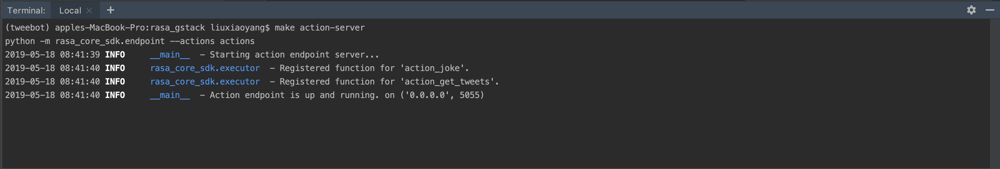
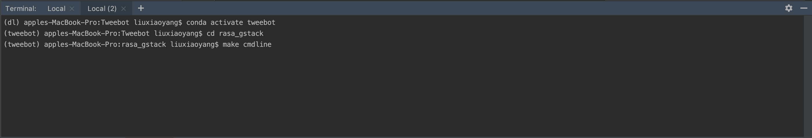
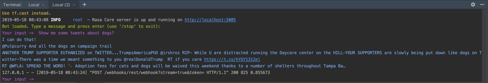
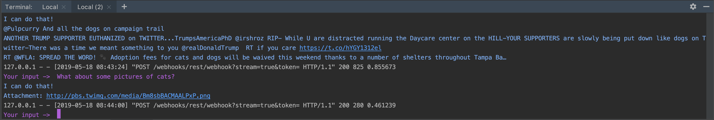

# Tweebot

Tweebot is a python chatbot that helps you with Twitter surfing!

## Installation
There are various required packages to install (rasa_nlu, rasa_core, rasa_core_sdk, tweepy, ...).
We also have to specify the versions to make them compatible with each other.
I suggest we figure this out later in a fresh new virtual environment 
and make a requirements.txt file to facilitate the installation.  

Or you might have some experience with packaging python library and 
then we can make an automatic installation script.

Let me know what you think.

```bash
pip install foobar
```

## Usage: rasa_gstack
This is the part I tweaked (Runjia). It's based on Gretchen's code so it's called rasa_**g**stack.

The current way to test it is through command line. I made the commands in the Makefile for your convenience.

Launch one terminal and type:
```bash
cd rasa_gstack

make action-server

# this is equivalent to
 
python -m rasa_core_sdk.endpoint --actions actions

# Note: you may have to replace python with python3
# I personally run this in a conda environment which only has python3.6 so I can simply use python, no confusion.
```
Now the server is running, launch another terminal and run:
```bash
cd rasa_gstack

make cmdline

# this is equivalent to

python -m rasa_core.run -d models/current/dialogue -u models/current/nlu --endpoints endpoints.yml
```

Then you can interact with the bot, such as:

Show me some tweets about dogs?

What about some pictures of cats?

For now I do not guarantee the nlu_model.py and dialogue_model.py work properly because 
there might be some path inconsistency regarding of model storage. 
This could be fixed easily when using them.

## Training:
I have trained the model so the above part should be working for you. If it does not, 
you may try to re-train the model yourself. To do this,

```bash
cd rasa_gstack
make train-nlu
make train-core
``` 

## Limitations for now:
The training set needs some improvement because right now it does not generalize properly.
This means that if "dogs" are mentioned in the data, it could identify "dogs" as a topic to search.
But if instead I told the bot to search for "pictures of wine", then it does not know "wine" is something to search for.

One way to improve this is to expand the dataset. Another fallback way is to make the bot ask the user if it does not know what to search.
This can be done using slot.

Before I fix this, let's keep the dialogues simple and predictable (resembles dataset) for testing purposes.

## Examples: 
Run server



Run core



Query tweets



Query pictures



The returned url linked to a picture like this


## Other things to be finely honed:

* Include the user name in the tweets results
* Respond in a more human-like way 
* Ask if not clear about something
* Make more options working
    * time range
    * account
    * tags    
* Fallback options to avoid errors