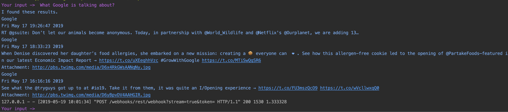
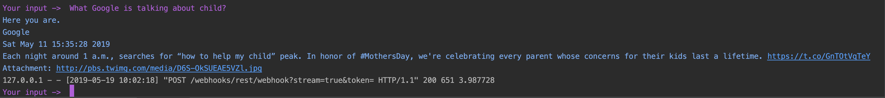
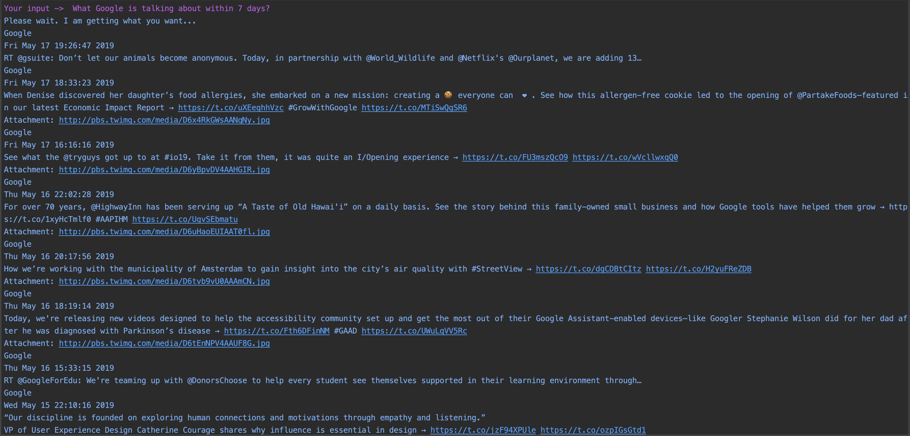
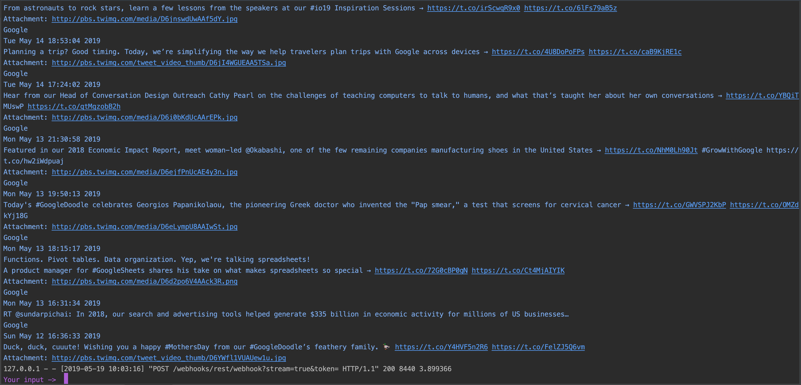
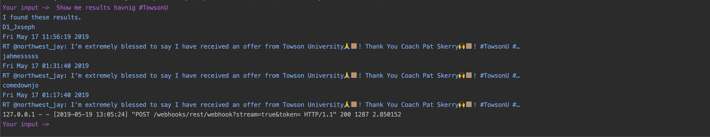

# Tweebot

Tweebot is a python chatbot that helps you with Twitter surfing!

## Installation
There are various required packages to install (rasa_nlu, rasa_core, rasa_core_sdk, tweepy, ...).
We also have to specify the versions to make them compatible with each other.
I suggest we figure this out later in a fresh new virtual environment 
and make a requirements.txt file to facilitate the installation.  

Or you might have some experience with packaging python library and 
then we can make an automatic installation script.

Let me know what you think.

```bash
pip install foobar
```

## Usage: rasa_gstack
This is the part I tweaked (Runjia). It's based on Gretchen's code so it's called rasa_**g**stack.

The current way to test it is through command line. I made the commands in the Makefile for your convenience.

Launch one terminal and type:
```bash
cd rasa_gstack

make action-server

# this is equivalent to
 
python -m rasa_core_sdk.endpoint --actions actions

# Note: you may have to replace python with python3
# I personally run this in a conda environment which only has python3.6 so I can simply use python, no confusion.
```
Now the server is running, launch another terminal and run:
```bash
cd rasa_gstack

make cmdline

# this is equivalent to

python -m rasa_core.run -d models/current/dialogue -u models/current/nlu --endpoints endpoints.yml
```

Then you can interact with the bot, such as:

Show me some tweets about dogs?

What about some pictures of cats?

For now I do not guarantee the nlu_model.py and dialogue_model.py work properly because 
there might be some path inconsistency regarding of model storage. 
This could be fixed easily when using them.

## Training:
I have trained the model so the above part should be working for you. If it does not, 
you may try to re-train the model yourself. To do this,

```bash
cd rasa_gstack
make train-nlu
make train-core
``` 

## Updates:

I added more nlu data to make the model generalize better.

The core can now handle all the entities with a practical workflow 
(account, topic, time range, pictures). Please refer to updated examples below to see performance.

I structured the outputs. Now for each tweets, it will return (utterance) the user name, the time posted, the text and the pictures (if any). 
For picture search, it only returns the picture url. I also figure out the tokenize and vectorize step, as is required and also necessary. 
The rationale is if we search a user's timeline, the returned results may or may not contain a specific topic. 
Therefore we need to measure the similarity between user's input and the results based on vectorization cosine similarity. 
This can recommend the most relevant result. But for direct topic search (api_search instead of user_timeline) without an account specified, 
we won't need the vectorization because the twitter search algorithm does that for us.

I also implemented a smart date/time parser. For now, if the core gets something like "7 days", it will filter the results returning 
only recent 7 days' tweets. (See examples below). 
A more arbitrary time range function needs more training data and I prefer not to look into it for now.

The core can also handle some exception cases with a request for more exact input, as you can see in the examples.

## Examples: 
Run server


Run core


Ask about a user



Ask about a user with specific topic



Ask about a user with specific time range (pay attention to the time)





Ask about a specific topic



Query pictures


The returned url linked to a picture like this


## Basic syntax:

* What is @google talking about on Twitter?
* Show me tweets containing #TowsonU
* Show me some tweets about dogs
* What is Walmart talking about within 2 days
* Show me some pictures of the moon.

## Things to be done:

* Connect to a GUI 
* Make a installation package

## Things not likely to be covered:

* Sentiment analysis (very brief based on existing data, no tuning)
* Wider time range search with advanced search (Twitter API only)
